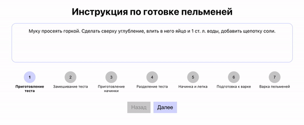

Необходимо разработать интерактивную инструкцию:

<strong>Функциональные требования по работе приложения:</strong>

-   При нажатии на кнопку 'Далее' происходит переход к следующему шагу. Если выбран
    последний шаг, то текст на кнопке заменяется на 'Начать сначала' и при клике на нее
    устанавливается самый первый шаг.
-   При нажатии на кнопку 'Назад' происходит переход к предыдущему шагу, но при условии,
    что активен не первый шаг (в этом случае кнопка заблокирована).
-   При нажатии на цифру конкретного шага (круглую кнопку) происходит переход к
    соответствующему шагу. Требования по состоянию кнопок из предыдущих двух пунктов также
    должны выполняться. Например, если был выбран первый шаг, кнопка 'Назад' также должна
    быть заблокирована.

Дана готовая верстка, а также заготовка компонента. Задача - реализовать логику внутри
файла `app.js`, соответствующую требованиям выше.

<strong>Пояснения и подсказки:</strong>

-   <strong>Заготовленные данные.</strong> В компоненте `App` импортирован `data` из файла
    `data.json`. В нем содержится заготовленный массив с данными для приложения —
    использовать его для вывода шагов и контента каждого шага.

-   <strong>Подготовить несколько состояний.</strong> Определить минимум 2 состояния с
    помощью `useState()`:

    -   `steps` — массив, в качестве значения по умолчанию использовать импортированный
        `data` из файла `data.json`.
    -   `activeIndex` — число (индекс) определяющее активный шаг. По умолчанию 0.

-   <strong>Обработчики.</strong> Определить несколько обработчиков: назад, вперед, начать
    сначала. Они будут срабатывать при клике на соответствующие кнопки. Внутри
    обработчиков обновлять состояние `activeIndex`.

-   <strong>Флаги.</strong> Также для удобства создать 2 переменных логического типа:
    -   На первом шаге.
    -   На последнем шаге.

Используя их в `JSX` разметке, можно выводить соответствующий контент в зависимости от
этих двух условий. Например, блокировать кнопку 'Назад' на первом шаге. Для определения
значений этих переменных можно использовать массив `steps` и активный индекс
`activeIndex`.

-   <strong>Вывод списка шагов.</strong> Шаги необходимо вывести циклично с помощью
    массива `steps`. CSS-класс `styles['steps-item']` должен быть у всех шагов. Класс
    `styles.active` только у текущего активного шага, а `styles.done` у всех тех, которые
    были выполнены и также у активного. Эти классы добавляются автоматически в зависимости
    от текущего активного шага. Добавить соответствующую проверку при выводе массив шагов.
    Для сравнения потребуется активный индекс `(activeIndex)` и индекс итерируемого шага
    (второй параметр в методе `map()`).
